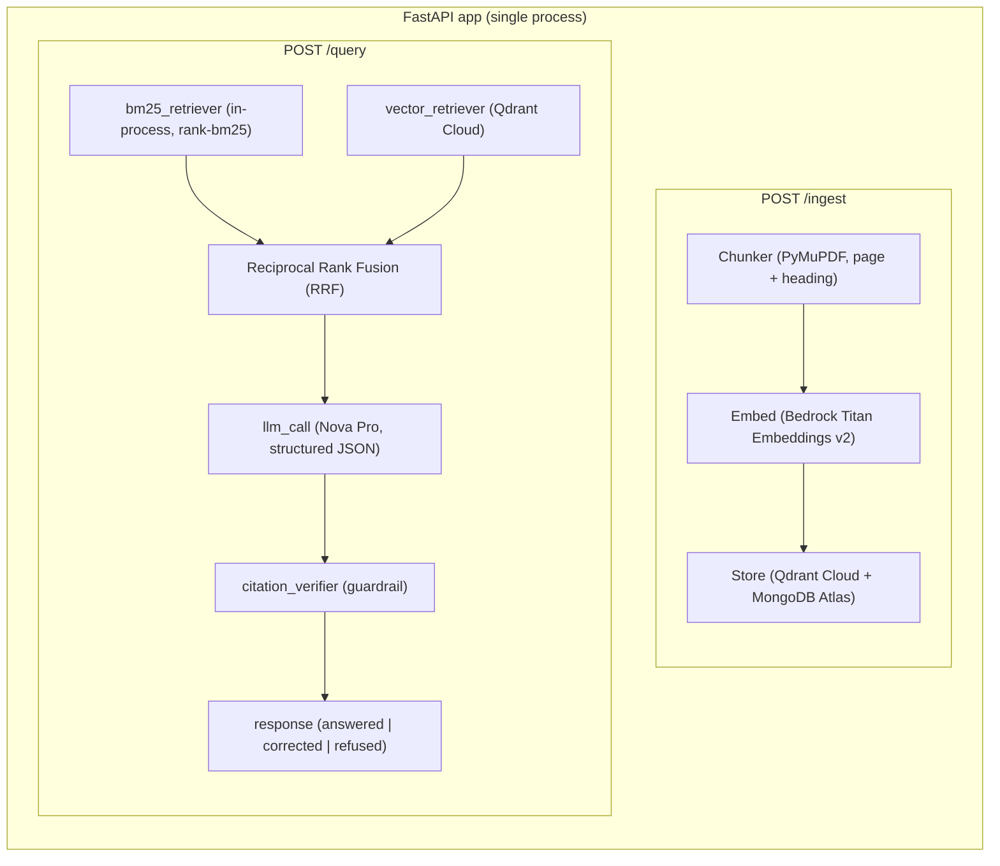

# ARCHITECTURE.md — KRE-lite: Single-Service, Hackathon-Scoped

## Deployment Model

ONE FastAPI service. ONE process. No microservices, no Lambda
packaging, no dual dev/prod provider matrix. This is a deliberate
scope decision — see BOUNDARIES.md for what was cut and why.



## Module Map

```text
app/
├── ingest/
│   ├── chunker.py          # splits by page + heading, keeps
│   │                       #   page_number + section_title on
│   │                       #   every chunk, no exceptions
│   ├── embed_service.py    # AWS Bedrock Titan Text Embeddings v2
│   │                       #   (amazon.titan-embed-text-v2:0, 1024-dim)
│   │                       #   via boto3. Exponential backoff on
│   │                       #   ThrottlingException.
│   └── store.py            # Dual-write: Qdrant Cloud (vectors +
│                           #   payload) + MongoDB Atlas (full chunk text)
├── query/
│   ├── bm25_retriever.py   # in-process BM25 (rank-bm25), built
│   │                       #   from MongoDB at query time, cache-
│   │                       #   invalidated on each /ingest
│   ├── vector_retriever.py # Qdrant similarity search (cosine,
│   │                       #   1024-dim), session-filtered
│   ├── fusion.py           # Reciprocal Rank Fusion combining
│   │                       #   BM25 and vector rankings
│   ├── rerank_service.py   # STUB ONLY — cut per hour-22 rule.
│   │                       #   File exists as empty placeholder.
│   ├── llm_service.py      # single call to AWS Bedrock Nova Pro
│   │                       #   (apac.amazon.nova-pro-v1:0) via
│   │                       #   Converse API. OpenRouter fallback.
│   │                       #   Structured JSON output only.
│   ├── citation_verifier.py # THE core guardrail — deterministic
│   │                       #   fuzzy-match + 3-state machine
│   │                       #   (answered / corrected / refused)
│   └── planner.py          # thin: retrieve -> fuse -> generate
│                           #   -> verify -> respond
├── api/
│   └── main.py             # POST /ingest, POST /analyze,
│                           #   POST /query, GET /health,
│                           #   GET /sessions/{id}
└── shared/
    └── schemas.py          # Pydantic models for structured I/O
```

## The Citation Verifier — Design Detail

This is the one component that must be bulletproof. Everything else
in this system is standard RAG plumbing; this is the differentiator.

```text
Input:  LLM's structured output
        {answer_draft, citations: [{page, section, quote}],
         premise_check: {contains_claim, claimed_value}}
        + the actual retrieved chunks (source of truth)

For each citation:
  1. Look up the chunk claimed by (page, section).
  2. Fuzzy-match `quote` against that chunk's raw text
     (normalized whitespace, case-insensitive, >=90% token overlap
     via simple ratio — NOT exact string match, LLMs paraphrase
     slightly even when asked not to).
  3. PASS -> citation kept, attached to final answer with a
     source-chunk offset for UI highlighting.
  4. FAIL -> citation (and the answer sentence it supports, if we
     can isolate it) is dropped.

3-State Response Machine (DECISION.md Rule 15):
  - If premise_check.contains_claim=True AND a verified citation
    numerically contradicts the claimed value:
      -> status="corrected" (false premise refuted with evidence)
  - If >=1 citation survives verification (no premise contradiction):
      -> status="answered"
  - If 0 citations survive:
      -> status="refused" (reason: no_grounded_answer)
```

This is deterministic code, not a second LLM call. Keep it that way
— an LLM "judge" checking an LLM's citations doubles your
hallucination surface and doubles your latency for no guaranteed
gain in a 48-hour build.

## Data Flow — Query Path (happy path)

1. User question -> BM25 top-k candidates from MongoDB chunk index
2. Same question embedded via Bedrock Titan v2 -> Qdrant vector search
   (session-filtered, fetch pool = max(top_k*4, 40) for dedup)
3. BM25 results + vector results -> Reciprocal Rank Fusion -> top N chunks
4. Top N chunks -> LLM prompt (Nova Pro), structured output forced
   (Converse API with JSON schema)
5. LLM output -> citation_verifier (3-state: answered/corrected/refused)
6. Verified answer + state -> API response -> UI

## Hard Constraints

- Maximum ONE LLM call per query. No agent loops, no re-planning,
  no self-critique LLM calls. Simplicity is what makes this buildable
  and testable in 48 hours.
- The LLM NEVER sees a raw prompt asking it to "be honest" as the
  only safeguard. The verifier is what actually enforces honesty.
  Prompting for honesty is a nice-to-have layer on top, not the
  guardrail itself.
- Every chunk in storage has `page_number` and `section_title`
  populated. If a document format can't reliably provide these
  (e.g. a PDF with no clear headings), fall back to
  `section_title = "Untitled section, page N"` — never null.
- No local model weights. Embeddings use AWS Bedrock Titan v2 API.
  Everything else (rerank stub, LLM) is an external API call — keeps
  the Docker image small and the setup reproducible.

## v1.1 — Two-Tier Retrieval + Confidence + Audit Agent

Scope: AFTER Phase 4 exit + deploy done. Not v1 core. Do not start
till v1 green.

NOTE: NOT KRE's PageIndex (structural score + graph). This = cheap
page-summary filter, diff design, diff name. BOUNDARIES.md v1
exclusion still stands for KRE's version; this is separate feature,
allowed.

### Two-Tier Retrieval

```text
Ingest: PDF page N -> cheap model (Groq/Gemini Flash) -> 1-sent
summary + keywords -> store in page_index table (page_num, summary,
keywords)

Query: embed query -> BM25/keyword match vs page_index -> top 3
pages -> vector search ONLY chunks in those 3 pages -> top 5 chunks
```

Cuts vector search space ~90%. Lower latency, lower token cost
(smaller context to LLM).

### Confidence Scoring (math only, 0 LLM cost)

```text
cosine_sim(query_embed, chunk_embed):
  > 0.85  -> HIGH   -> answer, green UI
  0.70-0.84 -> LOW  -> answer + "partial match, verify" flag, yellow UI
  < 0.70  -> REFUSE -> red UI, 0 tokens spent (skip LLM call entirely)
```

Runs BEFORE LLM call. Below-threshold query never reaches LLM — this
is stronger than v1's "verify after generation" and cheaper (no
wasted call). v1's citation_verifier.py stays as-is for HIGH/LOW
tier answers (post-generation check unchanged); this tier just gates
whether generation happens at all.

### Token/Latency Metrics

Wrap LLM call, capture `usage.prompt_tokens`,
`usage.completion_tokens`, `usage.total_tokens`, wall-clock latency,
pages_searched count. Return alongside answer (API.md v1.1 addendum).

### Context Compression

Pre-embed regex clean: strip URLs, page-number artifacts, excess
whitespace from chunk text. Force strict JSON LLM output (schema
already in API.md) — cuts conversational filler tokens.

### v1.1 Full Flow

```text
User Query
  |
  v
[Embed Query via Bedrock Titan v2] -> [Tier 1: Page Index match] -> Top 3 pages
  |
  v
[Tier 2: Vector search, filtered to those pages] -> Top 5 chunks
  |
  v
[Confidence Check] -> <0.70 -> Refuse, 0 tokens
  |
  v (>=0.70)
[Context Builder] -> clean + format
  |
  v
[LLM Nova Pro, structured JSON out] -> capture usage
  |
  v
[citation_verifier.py, unchanged from v1]
  |
  v
Return: answer + citations + confidence tier + token/latency metrics
```

### Custom Agent 2: `auditor-agent` (v1.1)

Separate flow from Q&A. User uploads a ruleset (numbered rules, free
text). Agent reads target doc, for EACH rule independently: retrieve
relevant chunks (same two-tier pipeline), generate Pass/Fail +
evidence citation, same citation_verifier gate applies per rule.
Output: structured report, one row per rule.

One LLM call per rule (not per doc) — DECISION.md Rule 1 amended for
v1.1, see DECISION.md v1.1 addendum below.

## Frontend Architecture (see UI-UX.md for detail)

Two-pane layout:
- Left: chat interface (question in, answer + citation chips out)
- Right: source document viewer, auto-scrolls to and highlights the
  cited page/section when a citation chip is clicked

No auth, no multi-tenant, no user accounts. Single-session, local
demo tool. This is explicit in BOUNDARIES.md.