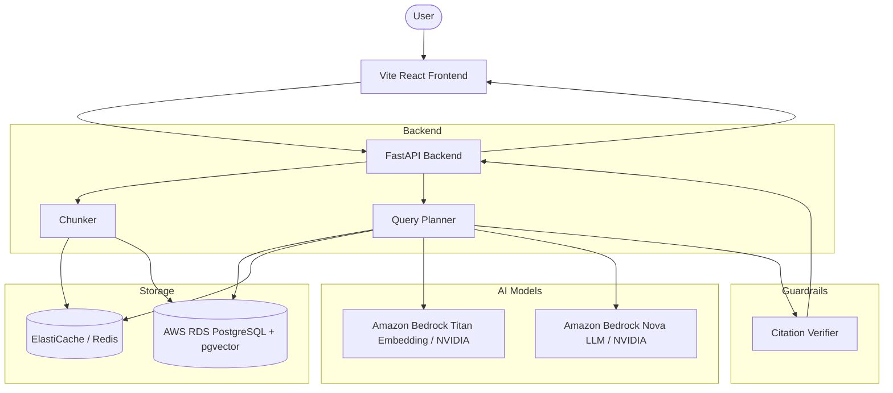

# ARCHITECTURE.md — Enterprise Cloud-Scoped

## Deployment Model

ONE FastAPI service running in the cloud, backed by AWS services (Bedrock, RDS, ElastiCache).
Frontend powered by Vite, React, Tailwind v4, and shadcn/ui.

## System Architecture Flow



## Module Map (in `backend/` directory)

```text
backend/app/
├── ingest/
│   ├── chunker.py          # splits by page + heading
│   ├── embed_service.py    # AWS Bedrock Titan / NVIDIA embedding wrapper
│   └── store.py            # AWS RDS (Postgres/pgvector) wrapper
├── query/
│   ├── bm25_retriever.py
│   ├── vector_retriever.py
│   ├── rerank_service.py   
│   ├── llm_service.py      # AWS Bedrock Nova / NVIDIA models
│   ├── citation_verifier.py # THE core guardrail
│   └── planner.py          
├── api/
│   └── main.py             # POST /ingest, POST /query, GET /health
└── shared/
    └── schemas.py          # Pydantic models
```

## Cost Effectiveness

By using AWS Bedrock, we only pay per token/request rather than running expensive GPU instances 24/7. ElastiCache reduces database load and repeat queries. RDS with `pgvector` scales cost-effectively for vector search without needing dedicated vector databases like Pinecone.

## Hallucination Tests

The system is evaluated against an adversarial refusal test suite. The goal is to prove the system refuses to answer queries that cannot be grounded in the source text. 

## Guardrails

**Citation Verifier:** This is the one component that must be bulletproof. It is deterministic code, not a second LLM call. It fuzzy-matches every cited quote against the raw text of the retrieved chunk. If verification fails, the citation is dropped. If no citations remain, a refusal is returned.

## Bedrock Models

We leverage Amazon Bedrock for scalable generative AI:
- **Embeddings:** Amazon Titan Text Embeddings (for high-dimensional semantic search).
- **LLM:** Amazon Nova models (for fast, structured output generation).

## NVIDIA Models

We also support NVIDIA NIMs / Build endpoints as an alternative to Bedrock for both embedding and generation, providing flexibility depending on model performance and availability.

## Frontend Architecture

Vite + React SPA using Tailwind CSS v4 and shadcn/ui components.
Two-pane layout: Chat interface on the left, source document viewer on the right with auto-scroll highlighting.
